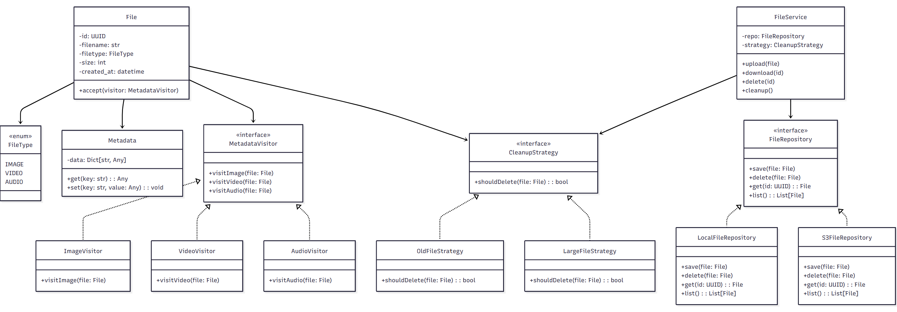
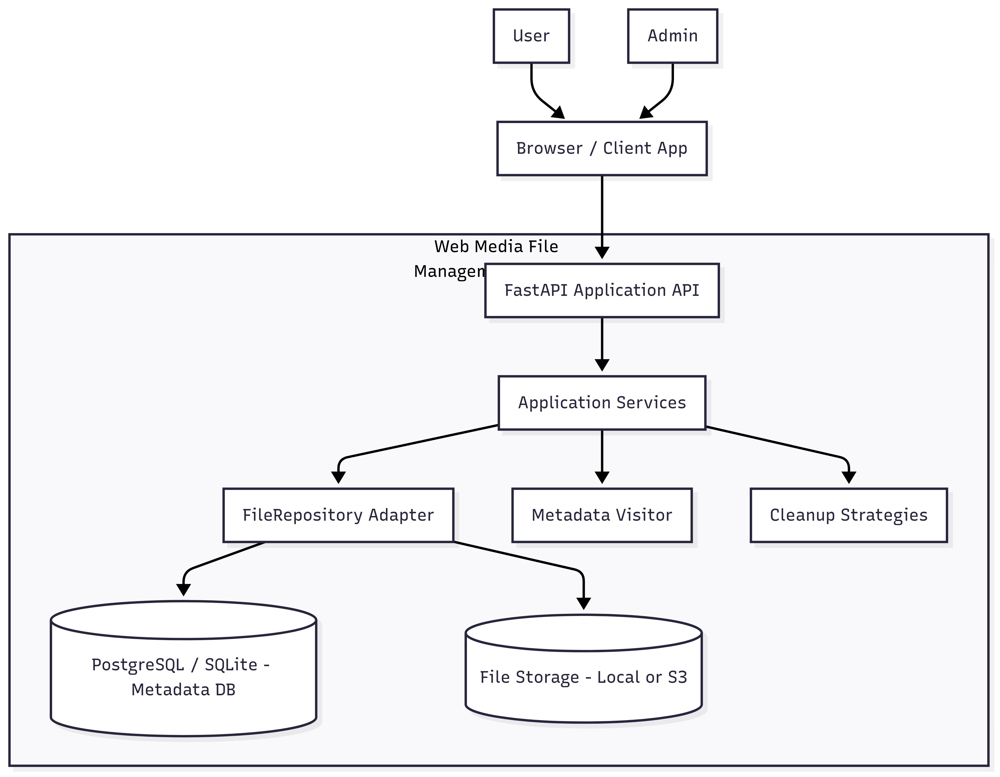

#  Web Media File Management System

A Python-based system to upload, manage, clean up, and analyze media files (image, video, audio) with security-first design.

---

##  Features

- Upload/download/delete files via REST API (FastAPI)
- Metadata extraction using Visitor pattern
- File cleanup via Strategy pattern (Oldest, Large, etc.)
- STRIDE threat modeling applied for security
- Kubernetes-ready deployment

---

##  Architecture Overview

>  See full documentation in `docs/`

### Class Diagram



### C4 Container View



---

##  Documentation

| Section | Link |
|--------|------|
| Business Requirements | [docs/business-requirements.md](docs/business-requirements.md) |
| Class Diagram | [docs/class-diagram.md](docs/class-diagram.md) |
| C4 Diagrams | [docs/c4-diagram.md](docs/c4-diagram.md) |
| STRIDE Threat Model | [docs/stride-threat-model.md](docs/stride-threat-model.md) |

---

##  Deployment (Kubernetes)

```bash
kubectl apply -f deployment.yaml
kubectl apply -f service.yaml