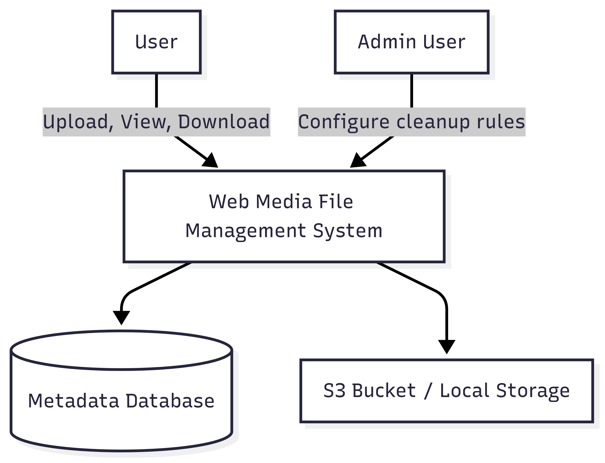
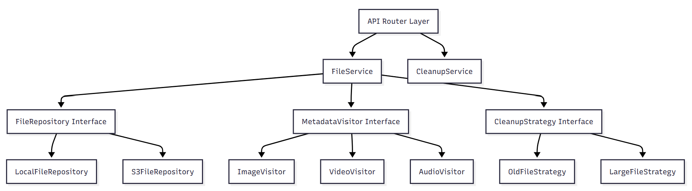

# 🏗️ C4 Architecture Diagrams

This document explains the Web Media File Management System’s architecture based on the C4 model — from a high-level system view to internal component design.

---

## 1️ Context Diagram

The Context Diagram outlines the key external actors and their interaction with the system.

### Key Actors

- **User**: Can upload, view, and download media files.
- **Admin User**: Can configure cleanup rules in addition to user capabilities.

### System Overview

The `Web Media File Management System` serves both end-users and administrators by managing metadata and storing files securely in either a local storage or S3-compatible cloud storage.

---

## 2️ Container Diagram

The Container Diagram breaks down the system into deployable units and major service responsibilities.

### Major Containers

| Container | Description |
|----------|-------------|
| **FastAPI Application API** | RESTful interface handling all requests from users and admins. |
| **Application Services** | Core service layer including business logic like file handling, metadata processing, and cleanup rules. |
| **FileRepository Adapter** | Interface to interact with the file storage backend (S3 or local). |
| **Metadata Visitor** | Applies appropriate metadata extraction logic depending on file type. |
| **Cleanup Strategies** | Applies rules to determine which files should be deleted (oldest, largest, etc.). |
| **Database** | Stores extracted metadata and audit logs. |

---

## 3️ Component Diagram

This diagram zooms into the internal design of the application services. It also reflects the use of patterns like **Visitor** and **Strategy**.

### Key Components

| Component | Description |
|----------|-------------|
| **FileService** | Handles file upload, download, and metadata extraction. Uses `MetadataVisitor` and `FileRepository`. |
| **CleanupService** | Uses cleanup strategy implementations to perform periodic or on-demand cleanups. |
| **MetadataVisitor Interface** | Defines `visitImage`, `visitVideo`, `visitAudio` methods — extended by type-specific visitors. |
| **CleanupStrategy Interface** | Defines the `shouldDelete(file)` interface, used by different strategies. |
| **FileRepository Interface** | Abstracts file saving, fetching, and deletion. Implemented by `LocalFileRepository` and `S3FileRepository`. |
| **API Router Layer** | Connects all services to FastAPI's routing layer, exposing secure endpoints. |

---

##  Design Patterns Applied

- **Visitor Pattern**: Used to extract type-specific metadata from files.
- **Strategy Pattern**: Used to allow pluggable file cleanup strategies.
- **Hexagonal Architecture**: The system follows clear separation between domain logic, adapters (infrastructure), and ports (interfaces).

---

##  Notes

- All FastAPI endpoints are routed through the `API Router Layer`.
- Both file data and extracted metadata are decoupled for flexibility and scalability.
- This structure allows future extensions such as video transcoding or scheduled cleanup via CRON jobs.

