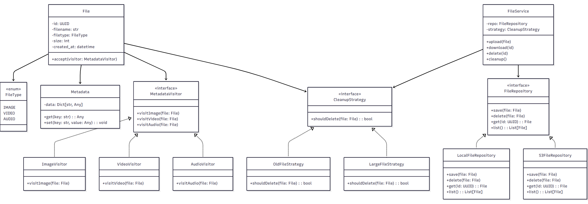

#  Class Diagram

This document provides an overview of the core classes used in the Web Media File Management System.  
It follows object-oriented principles and applies design patterns such as Visitor and Strategy.

---

##  Overview

The following image shows the class structure of the system:

---

##  Main Classes

### 🔹 `File`
- Represents a media file with basic attributes such as filename, size, and type.
- Implements the `accept()` method to support metadata extraction using the Visitor pattern.

### 🔹 `FileType` (Enum)
- Enum representing supported types: `IMAGE`, `VIDEO`, `AUDIO`.

### 🔹 `Metadata`
- Stores metadata extracted from a file as key-value pairs.
- Provides `get()` and `set()` methods.

### 🔹 `MetadataVisitor` (Interface)
- Defines the interface for visiting different file types (`visitImage`, `visitVideo`, `visitAudio`).

### 🔹 Visitors
- `ImageVisitor`, `VideoVisitor`, `AudioVisitor` implement metadata extraction logic for each media type.

---

##  Cleanup Strategy

### 🔹 `CleanupStrategy` (Interface)
- Defines a strategy interface for determining whether a file should be deleted.

### 🔹 Implementations:
- `OldFileStrategy`: Deletes files older than a certain threshold.
- `LargeFileStrategy`: Deletes files exceeding a certain size.

---

##  FileService

- Orchestrates file operations such as upload, download, delete, and cleanup.
- Uses a `FileRepository` and `CleanupStrategy`.

---

##  Repository Interfaces

### `FileRepository` (Interface)
- Basic CRUD for `File` objects

### `LocalFileRepository` / `S3FileRepository`
- Provide different storage backend implementations